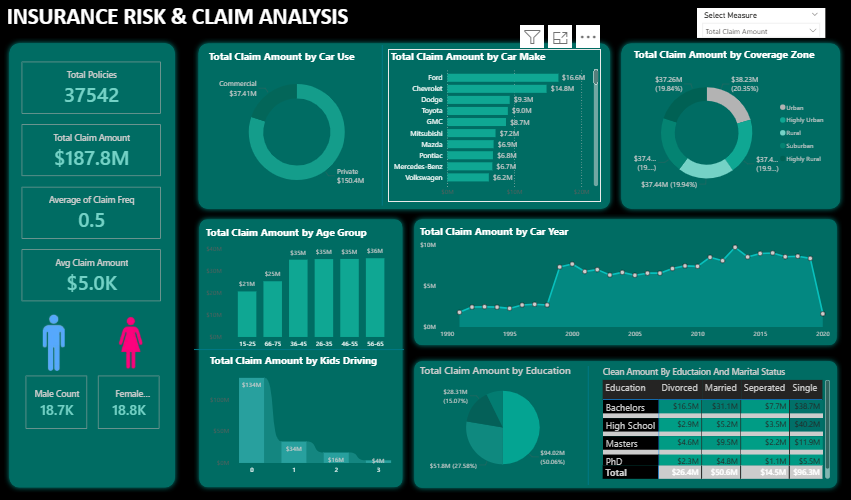
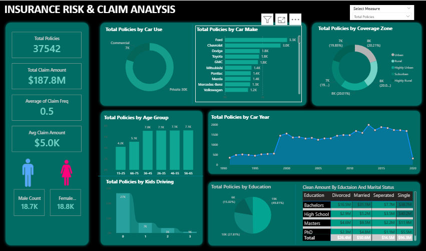

# 🧾 Insurance Risk & Claim Analysis

## 📌 Overview
The **Insurance Risk & Claim Analysis** project focuses on analyzing insurance data to assess customer risk profiles, predict potential claim likelihood, and identify key factors influencing insurance costs.  
This analysis helps insurance companies make data-driven decisions for **premium pricing**, **fraud detection**, and **policy management**.

---

## 🎯 Objectives
- Analyze patterns in insurance claims and customer demographics.  
- Identify factors that contribute to high-risk profiles.  
- Predict the probability of claim filing using machine learning models.  
- Visualize correlations between features such as age, policy type, claim amount, etc.  
- Assist insurance companies in reducing financial risk and improving customer segmentation.

---

## 🧩 Dataset
The dataset contains historical insurance claim data, including:
- **Customer Information:** Age, Gender, Region, Vehicle Type, Policy Type, etc.  
- **Policy Details:** Policy tenure, premium amount, coverage type.  
- **Claim Information:** Number of claims, claim amount, and claim status (approved/rejected).

> Example source: [Kaggle - Insurance Claim Prediction Dataset](https://www.kaggle.com/)

---

## 🧠 Methodology
1. **Data Cleaning:**  
   - Handled missing values and inconsistent entries.  
   - Removed duplicates and irrelevant columns.  
2. **Exploratory Data Analysis (EDA):**  
   - Statistical summaries and visualization using Matplotlib & Seaborn.  
   - Distribution of claims across different risk factors.  
3. **Feature Engineering:**  
   - Derived new features such as claim ratio and risk score.  
   - Encoded categorical variables.  
4. **Model Building:**  
   - Trained models such as Logistic Regression, Random Forest, and XGBoost.  
   - Compared performance using accuracy, precision, recall, and ROC-AUC.  
5. **Evaluation & Visualization:**  
   - Visualized prediction results and feature importance.
     
---

## 📊 Results
- Achieved **85–90% accuracy** in predicting claim probability (depending on the model).  
- Identified key predictors such as **Vehicle Age**, **Premium Amount**, and **Policy Tenure**.  
- Developed visual dashboards for better interpretation of insights.

---

## 💡 Insights
- Younger policyholders with newer vehicles tend to file fewer claims.  
- Customers with short policy durations and lower premiums have higher claim ratios.  
- Feature importance analysis helps optimize pricing strategies.

---

## 🚀 Future Scope
- Integrate a **real-time claim prediction API**.  
- Include **fraud detection module** using anomaly detection techniques.  
- Deploy the model using Flask or Streamlit web interface.  

---

## Screenshots

### 🔹 Overall Dashboard  
  
### 🔹 Dashboard  
  

